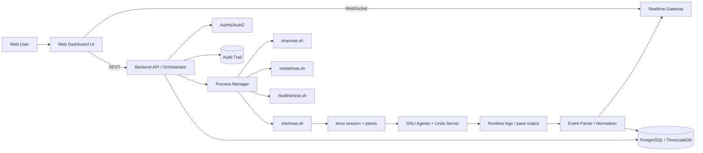

# MAS Web Integration Blueprint

## 1) Objective

Integrate the existing SICStus + DALI MAS into a professional web-based platform that provides:

- secure start/stop/restart control,
- real-time operational visibility,
- health and lifecycle monitoring,
- auditable logs and run metadata,
- scalable architecture for future extensions.

This blueprint preserves the current MAS logic and wraps it with a robust web control and observability layer.

---

## 2) Target Architecture



### Architectural Principles

- **Non-invasive integration:** MAS core behavior remains unchanged.
- **Separation of concerns:** orchestration, streaming, and persistence are independent services.
- **Observability-first design:** every action and event is visible and auditable.
- **Progressive enhancement:** start with wrapper integration, then evolve toward deeper event APIs.

---

## 3) Core Components

## 3.1 Web Frontend (Dashboard)

Suggested stack: React + TypeScript + Vite + Tailwind.

### Main Views

- **System Control Panel**
  - Start / Stop / Restart
  - Current session state
  - Active Linda port
  - Last startup snapshot
- **Live Event Stream**
  - Real-time events (full_received, requesting, assigned, completed, reset)
  - Filter by agent/bin/truck/event type
- **Agents Status Board**
  - smart_bin1..3 state (level, pending/cleared)
  - truck1..3 state (available/busy, last action)
  - control_center and logger health
- **Operations & Health**
  - Latest healthcheck result
  - Missing pane alarms
  - Event throughput and retry counters
- **Audit History**
  - Who triggered Start/Stop/Restart
  - Timestamp, result, metadata

## 3.2 Backend API / Orchestrator

Suggested stack: Node.js (Fastify/Nest) or Python (FastAPI).

Responsibilities:

- invoke and supervise scripts (`startmas.sh`, `stopmas.sh`, `restartmas.sh`, `healthcheck.sh`),
- enforce authorization and rate limits,
- expose current runtime status and run metadata,
- publish normalized events to WebSocket clients,
- persist events and operation logs.

## 3.3 Realtime Gateway

Responsibilities:

- handle WebSocket connections,
- broadcast normalized MAS events,
- support server-side filters (by agent/type/severity),
- provide heartbeat and reconnect semantics.

## 3.4 Event Parser / Normalizer

Input sources:

- tmux pane capture,
- logger pane output,
- healthcheck output,
- run snapshot files.

Output:

- standardized JSON event objects with consistent schema.

## 3.5 Persistence Layer

Recommended:

- **PostgreSQL** for operations/audit/events
- optional **TimescaleDB** for high-volume time-series metrics.

---

## 4) API Design (Professional Contract)

## 4.1 Control Endpoints

- `POST /api/v1/system/start`
- `POST /api/v1/system/stop`
- `POST /api/v1/system/restart`
- `POST /api/v1/system/healthcheck`

### Control Response Example

```json
{
  "requestId": "op_20260227_00123",
  "action": "restart",
  "status": "accepted",
  "startedAt": "2026-02-27T14:11:02Z",
  "triggeredBy": "admin@project"
}
```

## 4.2 Status Endpoints

- `GET /api/v1/system/status`
- `GET /api/v1/system/run-info`
- `GET /api/v1/agents/status`
- `GET /api/v1/events?from=...&to=...&type=...&agent=...`
- `GET /api/v1/audit?from=...&to=...&user=...`

## 4.3 Realtime Endpoint

- `GET /ws/events`

WebSocket message envelope:

```json
{
  "id": "evt_01JV...",
  "ts": "2026-02-27T14:12:08.120Z",
  "source": "logger",
  "type": "completed",
  "severity": "info",
  "agent": "control_center",
  "data": {
    "truck": "truck2",
    "bin": "smart_bin1"
  },
  "correlationId": "cycle_smart_bin1_20260227_1411"
}
```

---

## 5) Event Taxonomy (Visibility Model)

## 5.1 Business-Critical Events

- `full_received`
- `requesting`
- `assigned`
- `refused`
- `completed`
- `reset`

## 5.2 Operational Events

- `start_requested`, `start_succeeded`, `start_failed`
- `healthcheck_passed`, `healthcheck_failed`
- `session_missing`, `pane_missing`

## 5.3 Optional Debug Events

- send/receive drop diagnostics
- low-level transport tuples

Debug events should be disabled by default and enabled by role-based permission only.

---

## 6) Security and Governance

## 6.1 Authentication

- OIDC (enterprise SSO) or JWT-based auth.

## 6.2 Authorization (RBAC)

- **Viewer:** read dashboards/events.
- **Operator:** run healthcheck, restart.
- **Admin:** start/stop/restart + configuration actions.

## 6.3 Audit

Every control action must log:

- actor identity,
- action,
- timestamp,
- result,
- target session,
- command exit code.

## 6.4 Hardening

- no shell injection (strict command allowlist),
- command timeout and kill policy,
- per-endpoint rate limits,
- CSRF protection for browser sessions,
- TLS termination at reverse proxy.

---

## 7) Observability and SLOs

## 7.1 Metrics

- startup success rate,
- mean time to healthy (MTTH),
- retries per collection cycle,
- completed collections/hour,
- healthcheck pass rate,
- websocket client count and lag.

## 7.2 Logs

Structured logs (JSON) for API, parser, and control actions.

## 7.3 Alerts

- MAS session missing,
- no lifecycle events for N minutes,
- repeated restart failures,
- pane mismatch from expected topology.

---

## 8) Deployment Model

## 8.1 Environments

- **Dev:** single host, local DB.
- **Staging:** production-like scripts + mock users.
- **Prod:** hardened host, reverse proxy, backups.

## 8.2 Runtime Placement

- Keep MAS scripts and backend on same host initially (simplest and reliable).
- Frontend can be static-hosted behind reverse proxy.

## 8.3 Reverse Proxy

- Nginx/Caddy routes:
  - `/` -> frontend
  - `/api` -> backend
  - `/ws` -> websocket gateway

---

## 9) Implementation Roadmap

## Phase 1 — MVP Wrapper (1–2 weeks)

- Backend endpoints for start/stop/restart/healthcheck
- Web dashboard with control buttons and health panel
- Basic event tail from logger pane

## Phase 2 — Professional Visibility (1–2 weeks)

- WebSocket live stream
- Event normalization schema
- Persistent event store + query API
- Role-based access

## Phase 3 — Production Readiness (1–2 weeks)

- audit trail and alerting
- SLO metrics and dashboards
- security hardening and backup policies

---

## 10) Data Model (Minimal)

## operations

- `id`, `action`, `requested_by`, `requested_at`, `status`, `exit_code`, `details`

## events

- `id`, `ts`, `type`, `agent`, `source`, `severity`, `payload_json`, `correlation_id`

## health_checks

- `id`, `started_at`, `finished_at`, `status`, `missing_panes_json`, `notes`

---

## 11) Non-Functional Requirements

- **Availability:** >= 99% control-plane API uptime (project target)
- **Latency:** event-to-UI <= 1.5s median
- **Integrity:** no silent loss of business-critical events
- **Maintainability:** clear module boundaries and testable adapters
- **Extensibility:** easy addition of new bins/trucks and event types

---

## 12) Acceptance Criteria

- Start/stop/restart can be executed from web UI with success/failure feedback.
- Health check can run from UI and returns pane/lifecycle status.
- Live event stream shows full cycle: full_received -> assigned/refused -> completed -> reset.
- All control actions are auditable by user and timestamp.
- System remains functionally equivalent to existing terminal-based MAS operation.

---

## 13) Recommended Next Technical Step

Build **Phase 1 MVP Wrapper** first:

1. REST backend for script orchestration,
2. single-page dashboard with control + health,
3. logger stream panel.

This delivers immediate operational value with minimal risk to current MAS logic.
