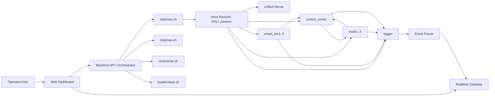

## Key Operational Characteristics

- Startup script automatically prepares environment and launches expected topology.
- Healthcheck validates both process-level and signal-level liveness.
- Runtime behavior relies on asynchronous event consumption from `past(...)` memory.
- Control-center state machines prevent dispatch races and stale inflight assignments.

---