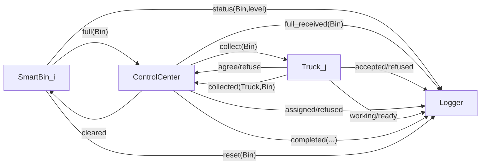

### Communication Semantics

- Message performative is primarily `inform(...)`.
- Control center is not a passive relay; it transforms event streams into coordination decisions.
- Logger receives semantically rich domain events from all operational roles.