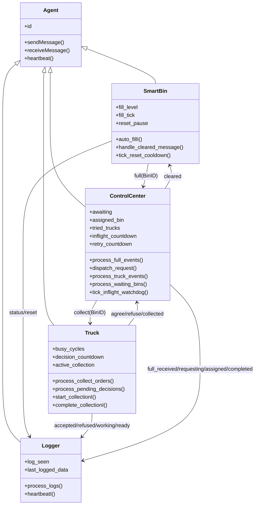

### Class Model Notes

This class diagram is an abstraction layer over logic predicates. It highlights stateful properties and functional services, enabling conceptual transfer from implementation-level predicates to software architecture notation.
