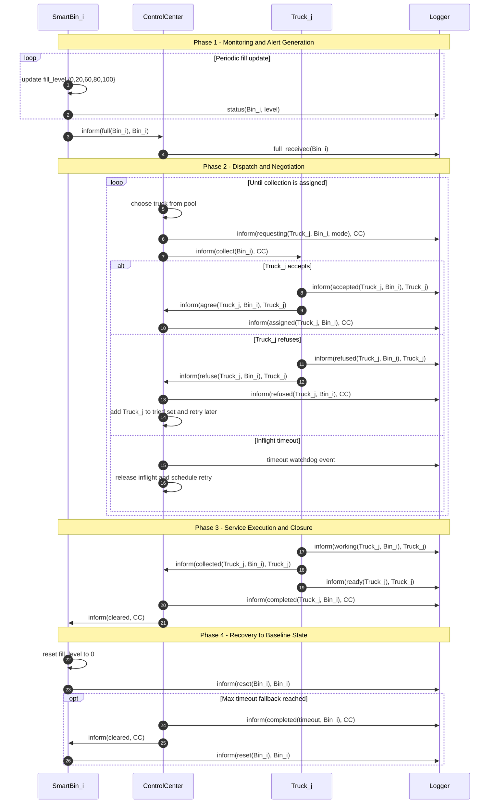

# Smart Waste Management MAS – Sequence Diagram

## Flow Overview
- The diagram models one full waste-collection lifecycle for a bin: detection, dispatch, service, and reset.
- Communication is asynchronous with `inform(...)` messages among `SmartBin_i,` `ControlCenter, Truck_j,` and Logger.

## Phase 1 — Monitoring & Alert
- SmartBin_i periodically increases internal fill level (0→20→60→80→100) and reports telemetry to `Logger.`
- At 100%, the bin sends `inform(full(Bin_i), Bin_i)` `to ControlCenter.`
- `ControlCenter` acknowledges this state transition by logging `full_received(Bin_i)` to `Logger.`

## Phase 2 — Dispatch & Negotiation
- ControlCenter selects a candidate truck from the pool, excluding already tried trucks and preferring idle ones.
- It emits `requesting(Truck_j, Bin_i, mode)` to Logger, then sends `inform(collect(Bin_i), CC)` to the truck.

- Three outcomes are modelled:
  - Accept: truck replies agree, logger records accepted, and control center records assigned.
  - Refuse: truck replies refuse, logger records refusal, control center adds truck to tried set and retries later.
  - Timeout: if no valid progress before watchdog expiry, control center releases inflight state and schedules retry.

## Phase 3 — Service & Closure
- Assigned truck starts work (working to Logger), then sends inform(collected(...)) to ControlCenter.
- Truck reports ready to Logger (available again).
- ControlCenter emits completed(Truck_j, Bin_i) to Logger and sends inform(cleared, CC) to the bin.

## Phase 4 — Recovery
- SmartBin_i resets internal level to zero, enters cooldown, and emits reset(Bin_i) to Logger.
- The system returns to baseline and can start a new cycle.

## Fallback Path
- If repeated timeouts hit the configured maximum, ControlCenter forces completion (completed(timeout, Bin_i)), still sends cleared, and the bin resets—preventing deadlock.

